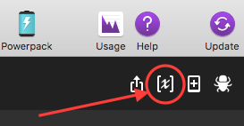

# redbooth-alfred

One Paragraph of project description goes here

### Prerequisites

* [Git](https://git-scm.com/)
* [Ruby](https://www.ruby-lang.org/en/downloads/)
* [Bundler](http://bundler.io/)

### Primary Ruby Gem Dependancies

* redbooth-ruby
* json

### Installation

* Clone the repository
```bash
git clone```

* Update Homebrew
```bash
brew update
```

* Update Ruby
```bash
brew install ruby```

* Install Bundler ( http://bundler.io/ )
```bash
gem install bundler```

* Open the workflow in your terminal

	1. Navigate to the Workflow in Alfred and right click
	2. Click "Open in Terminal"


* Install the gems
```bash
bundle install
```
* follow the the Steps for Authorizing/Authenticating here: https://redbooth.com/api/authentication/
* create file to store auth variables in the root of the repo dir
```bash
touch redbooth_ENV.rb
```
* populate the file with this template to be filled out after authentication/authorization
```ruby
module AuthVars
  Client_id = 'your client id'
  Client_secret = 'your secret'
  Token = 'your token'
  Refresh_token = 'your refresh token'
end
```
* Add the your app's return URI registered with Redbooth as an environment variable named 'return_uri'
	* 
	* Open the 'Redbooth Integration v1' alfred workflow file from the repo dir
* Try out one of the lovely Alfred keywords

## Known Bugs
* none recorded at this time

## Authors

Kat Gifford, Dominic Brown

## License

*open source GPL & MIT*

```
Copyright (c) 2017 **Pancake Creative**
```

## Contributing

(link to contributing info)

## Authors

* **Dominic Brown** - *Initial work* - [GitHub](https://github.com/Umitosan)
* **Kat Gifford** - *Initial work* - [GitHub](https://github.com/PiKatso)
* **John Buckingham** - *Revisions* - [GitHub](https://github.com/johnbuck)

## License

This project is licensed under the MIT License - see the [LICENSE.md](LICENSE.md) file for details

## Acknowledgments

* Hat tip to anyone who's code was used
* Inspiration
* etc
